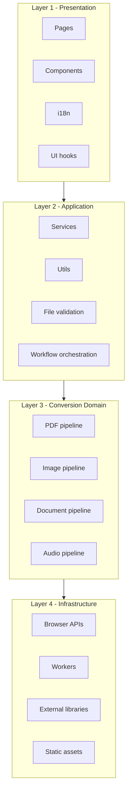

# PDF XinoConvert

[](https://github.com/helioasjunior/pdf-xino-convert/actions/workflows/validate-pr.yml)
[](LICENSE)
[](https://nodejs.org/)

Web platform for file conversion, organization, and preparation with a strong productivity focus.

This repository is frontend-only, built with React + Vite, with most processing executed locally in the browser.

Main Portuguese documentation: [README.md](README.md)

- Frontend workspace: `frontend/`
- Static GitHub Pages output: `docs/`

## Table of Contents

- [Language](#language)
- [Overview](#overview)
- [Core capabilities](#core-capabilities)
- [Interface languages](#interface-languages)
- [Architecture](#architecture)
- [Layered architecture](#layered-architecture)
- [Technology stack](#technology-stack)
- [Repository structure](#repository-structure)
- [Prerequisites](#prerequisites)
- [Installation](#installation)
- [Environment variables](#environment-variables)
- [Local development](#local-development)
- [Build, preview, and deployment](#build-preview-and-deployment)
- [Scanner (local bridge)](#scanner-local-bridge)
- [Security and privacy](#security-and-privacy)
- [Known limitations](#known-limitations)
- [Troubleshooting](#troubleshooting)
- [Available scripts](#available-scripts)
- [Contributing](#contributing)
- [Roadmap](#roadmap)
- [License](#license)

## Language

- Main documentation (Portuguese): [README.md](README.md)
- English documentation: [README.en.md](README.en.md)

## Overview

PDF XinoConvert unifies PDF, image, document, scanner, and utility workflows in one application.

Primary goals:

- reduce friction in repetitive file-processing tasks
- keep sensitive processing client-side whenever possible
- support straightforward static deployment (GitHub Pages)

## Core capabilities

### PDF tools

- Image to PDF (multi-upload, file ordering, single or separate output)
- PDF to Images (JPG/PNG plus ZIP packaging)
- In-browser PDF compression
- Merge PDF
- Split PDF
- Rotate PDF pages
- Remove pages
- Extract pages

### Image tools

- Conversion between JPG, PNG, WEBP, BMP, and GIF
- HEIC/HEIF input support
- Batch processing with ZIP output

### Document tools

- Document to PDF conversion for TXT, MD, RTF, DOCX, CSV, XLS, and XLSX
- Scan-oriented preparation flow

### Scanner flow

- Optional local bridge integration
- Mock provider for development/testing
- Import, prepare, and export scanned output as PDF

### Audio tools

- Conversion across MP3, WAV, OGG, FLAC, AAC, M4A, MP4, and OPUS
- Batch conversion (current limit: 10 files)

### Utilities

- ZIP packaging for multiple downloads
- Automatic file-type detection and tool suggestion

### UX / UI

- Responsive layout for desktop and mobile
- Floating desktop sidebar
- Light/dark theme
- Progress and state feedback
- Category-driven navigation

## Interface languages

Supported languages:

- Portuguese (pt-BR)
- English (en)
- Spanish (es)
- French (fr)

Implementation notes:

- `i18next` + `react-i18next`
- language persisted via `localStorage`
- SVG flags located in `frontend/public/assets/flags/`

## Architecture

### Frontend-first for GitHub Pages

The application is designed for static publishing in `docs/`.

- SPA routing through `HashRouter`
- versioned and optimized assets generated by Vite
- local browser processing for primary workflows

### Simple workspace layout

- root scripts orchestrate build/preview/deploy
- `frontend` contains the React application
- `docs` contains publishable artifacts

## Layered architecture



## Technology stack

### Frontend

- React 18
- Vite
- Tailwind CSS
- React Router
- i18next + react-i18next
- dnd-kit
- pdf-lib
- pdfjs-dist
- jsPDF
- JSZip
- heic2any
- browser-image-compression
- ffmpeg.wasm (runtime loaded)
- Mammoth
- xlsx
- Lucide React

## Repository structure

```text
.
├─ docs/
│  ├─ index.html
│  ├─ assets/
│  ├─ css/
│  └─ js/
├─ frontend/
│  ├─ public/
│  │  ├─ assets/
│  │  │  ├─ flags/
│  │  │  ├─ social/
│  │  │  └─ visuals/
│  │  └─ favicon_pdf.ico
│  ├─ src/
│  │  ├─ components/
│  │  ├─ hooks/
│  │  ├─ i18n/
│  │  ├─ pages/
│  │  ├─ scanner/
│  │  ├─ services/
│  │  └─ utils/
│  ├─ index.html
│  └─ vite.config.js
├─ scripts/
├─ package.json
├─ README.md
└─ README.en.md
```

## Prerequisites

- Node.js 20+
- npm 10+

## Installation

From the project root:

```bash
npm install
```

This installs dependencies for root and `frontend` workspace.

## Environment variables

### Frontend

Example file: `frontend/.env.example`

```env
VITE_SCANNER_PROVIDER=bridge
VITE_SCANNER_BRIDGE_URL=http://127.0.0.1:24833
```

Notes:

- Set `VITE_SCANNER_PROVIDER=mock` to test scanner UI without physical hardware.

## Local development

From root:

```bash
npm run dev
```

Default URL: `http://localhost:5173`

Equivalent workspace command:

```bash
npm run dev -w frontend
```

## Build, preview, and deployment

### Production build

```bash
npm run build
```

### Build for static pages

```bash
npm run build:pages
```

Final artifacts are generated in `docs/`.

During build, `scripts/generate-route-entrypoints.mjs` creates route-level `index.html`
files (for example `docs/pdf-tools/index.html`) to avoid direct-access 404 issues.

### Preview build locally

```bash
npm run preview:pages
```

### CI/CD with GitHub Actions

Primary workflows:

- `.github/workflows/validate-pr.yml`
- `.github/workflows/deploy-pages.yml`

Expected flow:

1. Pull request validates build in CI
2. Push to main branch builds and deploys GitHub Pages

Public URL:

- https://helioasjunior.github.io/pdf-xino-convert/

## Scanner (local bridge)

Scanner providers:

- `frontend/src/scanner/providers/ScannerProvider.js`
- `frontend/src/scanner/providers/LocalBridgeScannerProvider.js`
- `frontend/src/scanner/providers/MockScannerProvider.js`

Expected local bridge endpoints:

- `GET /status`
- `GET /devices`
- `POST /connect`
- `POST /scan`
- `POST /cancel`

Scanner-free test flow:

1. Set `VITE_SCANNER_PROVIDER=mock`
2. Run `npm run dev`
3. Open the scan page

## Security and privacy

- Primary workflows run client-side
- Files are not sent to a project backend by default
- Some features rely on runtime third-party assets (for example FFmpeg CDN)

Recommendation:

- Validate network and CDN policies for restricted enterprise environments.

## Known limitations

- Some office formats (DOC, ODT, PPT, PPTX) may have partial fidelity in fully client-side conversion.
- Recomposition-based PDF compression can introduce visual degradation at aggressive levels.
- Audio conversion depends on runtime FFmpeg loading.
- First use of some tools may be slower due to initial asset download.

## Troubleshooting

### "File format not accepted" for HEIC/HEIF

- Ensure file extension is `.heic` or `.heif`
- Update to the latest project version (extension fallback and preview fallback are included)

### HEIC image preview does not render

- Some browsers do not natively display HEIC in ``
- The project includes a HEIC-to-preview fallback; if it still fails, test in an up-to-date Chromium browser

### Preview port already in use

Use root scripts:

```bash
npm run kill:4173
npm run preview:pages
```

## Available scripts

### Root

- `npm run dev` starts frontend dev mode
- `npm run build` production build + static route entrypoint generation
- `npm run build:pages` alias for static build
- `npm run preview:pages` preview static build
- `npm run preview:pages:auto` preview without strict port
- `npm run kill:port` kill process by port
- `npm run kill:4173` kill port 4173
- `npm run qa:assets` generate QA assets
- `npm run test:xlsx-pdf` run XLSX-to-PDF test routine

### Frontend workspace

- `npm run dev -w frontend`
- `npm run build -w frontend`
- `npm run preview -w frontend`

## Contributing

Suggested flow:

1. Create a feature branch
2. Run `npm install`
3. Develop and validate with `npm run dev`
4. Validate production build with `npm run build`
5. Open PR with clear functional impact and manual test notes

Best practices:

- keep PR scope focused
- avoid changing `docs/` artifacts unless deployment/build output is intended
- include reproducible context for bug fixes

## Roadmap

- Per-user history persistence
- Async queue for large files
- Better fidelity for complex office formats
- Optional remote processing pipeline

## License

This project is licensed under the terms of [LICENSE](LICENSE).
