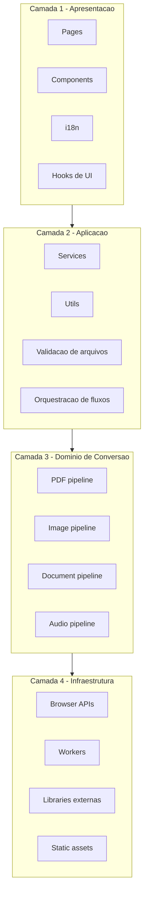

# PDF XinoConvert

[](https://github.com/helioasjunior/pdf-xino-convert/actions/workflows/validate-pr.yml)
[](LICENSE)
[](https://nodejs.org/)

Plataforma web para conversao, organizacao e preparacao de arquivos com foco em produtividade.

O projeto e frontend-only, com interface em React + Vite e processamento local no navegador.

Versao em ingles: [README.en.md](README.en.md)

- Workspace frontend: `frontend/`
- Build estatico para GitHub Pages: `docs/`

## Sumario

- [Idioma](#idioma)
- [Visao geral](#visao-geral)
- [Principais recursos](#principais-recursos)
- [Idiomas da interface](#idiomas-da-interface)
- [Arquitetura](#arquitetura)
- [Arquitetura em camadas](#arquitetura-em-camadas)
- [Stack tecnologica](#stack-tecnologica)
- [Estrutura do repositorio](#estrutura-do-repositorio)
- [Pre-requisitos](#pre-requisitos)
- [Instalacao](#instalacao)
- [Variaveis de ambiente](#variaveis-de-ambiente)
- [Execucao local](#execucao-local)
- [Build, preview e deploy](#build-preview-e-deploy)
- [Scanner (bridge local)](#scanner-bridge-local)
- [Seguranca e privacidade](#seguranca-e-privacidade)
- [Limitacoes conhecidas](#limitacoes-conhecidas)
- [Troubleshooting](#troubleshooting)
- [Scripts disponiveis](#scripts-disponiveis)
- [Contribuicao](#contribuicao)
- [Roadmap](#roadmap)
- [Licenca](#licenca)

## Idioma

- Documentacao principal (PT-BR): [README.md](README.md)
- English version: [README.en.md](README.en.md)

## Visao geral

O PDF XinoConvert consolida ferramentas de PDF, imagem, documentos, scanner e utilitarios em uma unica experiencia.

Objetivos principais:

- reduzir friccao em tarefas recorrentes de manipulacao de arquivos
- manter operacoes sensiveis no navegador (client-side)
- permitir publicacao simples em ambiente estatico (GitHub Pages)

## Principais recursos

### PDF

- Imagem para PDF com upload multiplo, organizacao de ordem e exportacao unica ou separada
- PDF para imagens (JPG/PNG) com pacote ZIP
- Compressao de PDF no navegador
- Juntar PDF
- Dividir PDF
- Rotacionar PDF por paginas
- Remover paginas
- Extrair paginas

### Imagem

- Conversao entre JPG, PNG, WEBP, BMP e GIF
- Suporte de entrada para HEIC/HEIF
- Processamento em lote com download final em ZIP

### Documentos

- Conversao para PDF de TXT, MD, RTF, DOCX, CSV, XLS e XLSX
- Fluxo de digitalizacao com preparacao de paginas

### Scanner

- Integra com bridge local opcional
- Fluxo alternativo com provider mock para desenvolvimento
- Etapas de importacao, preparacao e saida em PDF

### Audio

- Conversao entre MP3, WAV, OGG, FLAC, AAC, M4A, MP4 e OPUS
- Conversao em lote (limite atual de 10 arquivos)

### Utilitarios

- Geracao de ZIP para multiplos arquivos
- Deteccao automatica de tipo de arquivo com sugestao de ferramenta

### UX / UI

- Interface responsiva (desktop e mobile)
- Sidebar flutuante no desktop
- Tema claro/escuro
- Feedback de progresso e estado
- Navegacao por categorias de ferramenta

## Idiomas da interface

Idiomas disponiveis:

- Portugues (pt-BR)
- English (en)
- Espanol (es)
- Francais (fr)

Implementacao:

- `i18next` + `react-i18next`
- idioma persistido em `localStorage`
- bandeiras SVG em `frontend/public/assets/flags/`

## Arquitetura

### Frontend-first para GitHub Pages

A aplicacao e preparada para deploy estatico em `docs/`.

- roteamento SPA com `HashRouter`
- assets versionados e otimizados pelo Vite
- processamento local no navegador para fluxos principais

### Monorepo simples com workspaces

- raiz controla scripts de build/preview/deploy
- `frontend` concentra o app React
- `docs` concentra artefatos para publicacao

## Arquitetura em camadas



## Stack tecnologica

### Frontend

- React 18
- Vite
- Tailwind CSS
- React Router
- i18next + react-i18next
- dnd-kit
- pdf-lib
- pdfjs-dist
- jsPDF
- JSZip
- heic2any
- browser-image-compression
- ffmpeg.wasm (carregado em runtime)
- Mammoth
- xlsx
- Lucide React

## Estrutura do repositorio

```text
.
├─ docs/
│  ├─ index.html
│  ├─ assets/
│  ├─ css/
│  └─ js/
├─ frontend/
│  ├─ public/
│  │  ├─ assets/
│  │  │  ├─ flags/
│  │  │  ├─ social/
│  │  │  └─ visuals/
│  │  └─ favicon_pdf.ico
│  ├─ src/
│  │  ├─ components/
│  │  ├─ hooks/
│  │  ├─ i18n/
│  │  ├─ pages/
│  │  ├─ scanner/
│  │  ├─ services/
│  │  └─ utils/
│  ├─ index.html
│  └─ vite.config.js
├─ scripts/
├─ package.json
├─ README.md
└─ README.en.md
```

## Pre-requisitos

- Node.js 20+
- npm 10+

## Instalacao

Na raiz do projeto:

```bash
npm install
```

Esse comando instala dependencias da raiz e do workspace `frontend`.

## Variaveis de ambiente

### Frontend

Arquivo de exemplo: `frontend/.env.example`

```env
VITE_SCANNER_PROVIDER=bridge
VITE_SCANNER_BRIDGE_URL=http://127.0.0.1:24833
```

Notas:

- `VITE_SCANNER_PROVIDER=mock` permite testar fluxo de scanner sem hardware

## Execucao local

Na raiz:

```bash
npm run dev
```

URL padrao: `http://localhost:5173`

Comando equivalente no workspace:

```bash
npm run dev -w frontend
```

## Build, preview e deploy

### Build local

```bash
npm run build
```

### Build para paginas estaticas

```bash
npm run build:pages
```

O artefato final e gerado em `docs/`.

Durante o build, o script `scripts/generate-route-entrypoints.mjs` cria `index.html`
em rotas publicas (exemplo: `docs/pdf-tools/index.html`) para evitar 404 em acesso direto.

### Preview local do build

```bash
npm run preview:pages
```

### CI/CD com GitHub Actions

Workflows principais:

- `.github/workflows/validate-pr.yml`
- `.github/workflows/deploy-pages.yml`

Fluxo esperado:

1. Pull request para branch principal valida build
2. Push na branch principal gera build e publica no GitHub Pages

URL publica:

- https://helioasjunior.github.io/pdf-xino-convert/

## Scanner (bridge local)

Providers da camada de scanner:

- `frontend/src/scanner/providers/ScannerProvider.js`
- `frontend/src/scanner/providers/LocalBridgeScannerProvider.js`
- `frontend/src/scanner/providers/MockScannerProvider.js`

Endpoints esperados do bridge local:

- `GET /status`
- `GET /devices`
- `POST /connect`
- `POST /scan`
- `POST /cancel`

Teste sem scanner fisico:

1. Defina `VITE_SCANNER_PROVIDER=mock`
2. Rode `npm run dev`
3. Acesse a pagina de escaneamento

## Seguranca e privacidade

- Os fluxos principais rodam client-side
- Arquivos nao sao enviados para backend do projeto
- Dependencias de runtime (como FFmpeg via CDN) podem existir em algumas funcionalidades

Recomendacao:

- Para ambientes corporativos restritivos, valide politicas de rede/CDN antes da adocao

## Limitacoes conhecidas

- Alguns formatos de escritorio (DOC, ODT, PPT, PPTX) podem ter fidelidade parcial em conversao puramente client-side
- Compressao de PDF por recomposicao de paginas pode gerar perda visual em niveis agressivos
- Conversor de audio depende de carregamento de FFmpeg em runtime
- Primeira carga de algumas ferramentas pode ser mais lenta por download inicial de assets

## Troubleshooting

### Erro de formato aceito para HEIC/HEIF

- Verifique se o arquivo termina com `.heic` ou `.heif`
- Atualize para a versao mais recente do projeto (suporte por extensao e fallback de preview)

### Preview de imagem nao aparece

- Alguns navegadores nao renderizam HEIC diretamente
- O projeto aplica fallback de decodificacao para preview; se falhar, teste outro navegador Chromium atualizado

### Porta em uso no preview

Use scripts auxiliares na raiz:

```bash
npm run kill:4173
npm run preview:pages
```

## Scripts disponiveis

### Raiz

- `npm run dev` inicia frontend
- `npm run build` build de producao do frontend e geracao de entrypoints estaticos
- `npm run build:pages` alias para build de paginas
- `npm run preview:pages` preview do build
- `npm run preview:pages:auto` preview sem strictPort
- `npm run kill:port` encerra processo por porta
- `npm run kill:4173` encerra porta 4173
- `npm run qa:assets` gera assets de QA
- `npm run test:xlsx-pdf` executa rotina de teste para fluxo de planilha->PDF

### Frontend workspace

- `npm run dev -w frontend`
- `npm run build -w frontend`
- `npm run preview -w frontend`

## Contribuicao

Sugestao de fluxo:

1. Crie branch de feature
2. Rode `npm install`
3. Desenvolva e valide com `npm run dev`
4. Gere build com `npm run build`
5. Abra PR com descricao clara de impacto funcional

Boas praticas:

- manter mudancas focadas por PR
- evitar alterar artefatos `docs/` quando o objetivo for apenas desenvolvimento local
- incluir contexto funcional e teste manual no PR

## Roadmap

- Persistencia de historico por usuario
- Fila assincrona para arquivos grandes
- Melhor fidelidade para formatos de escritorio complexos
- Pipeline opcional de processamento remoto

## Licenca

Este projeto esta licenciado sob os termos do arquivo [LICENSE](LICENSE).

